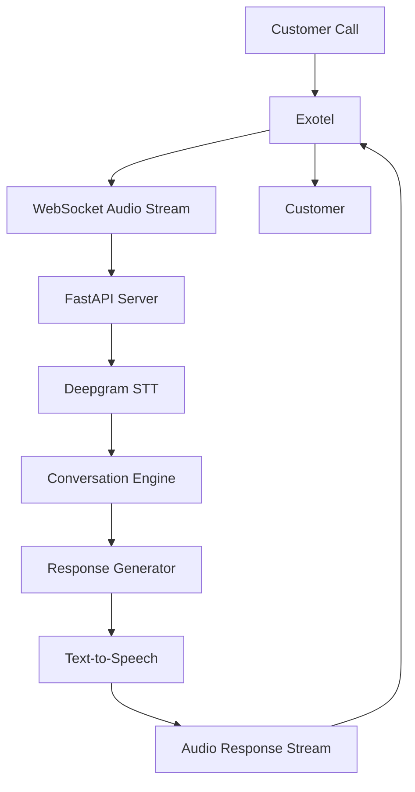
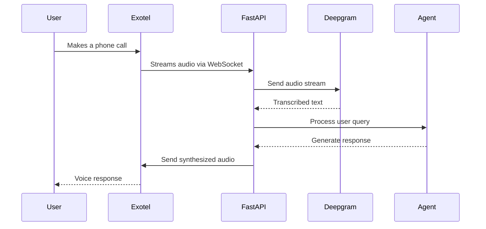

# 🎙️ Autonomous AI Voice Agent

An AI-powered real-time voice assistant that automates customer interactions through phone calls. The system leverages speech recognition, conversational intelligence, and telephony integration to deliver natural, low-latency voice conversations without human intervention.

---

## 🚀 Features

- Real-time voice conversations
- Deepgram Speech-to-Text (STT)
- FastAPI backend with WebSockets
- Exotel telephony integration
- Low-latency audio streaming
- Bidirectional voice communication
- Dynamic response generation
- Scalable event-driven architecture
- Automated customer support workflows
- Production-ready API design

---

## 🏗️ System Architecture



---

## 🔄 Workflow



---

## 🛠️ Tech Stack

### Backend
- Python
- FastAPI
- AsyncIO
- WebSockets

### Speech Processing
- Deepgram Speech-to-Text
- Real-Time Audio Streaming

### Telephony
- Exotel Voice API

### Development
- Git
- GitHub
- REST APIs
- Environment Variables

---

## 📂 Project Structure

```text
Autonomous-AI-Voice-Agent/
│
├── main.py
├── websocket_handler.py
├── deepgram_service.py
├── exotel_handler.py
├── requirements.txt
├── .env
│
├── static/
│
├── logs/
│
└── README.md
```

---

## ⚙️ Installation

### Clone Repository

```bash
git clone https://github.com/prem970/Autonomous-AI-Voice-Agent.git

cd Autonomous-AI-Voice-Agent
```

### Create Virtual Environment

```bash
python -m venv venv
```

### Activate Environment

Windows

```bash
venv\Scripts\activate
```

Linux / Mac

```bash
source venv/bin/activate
```

### Install Dependencies

```bash
pip install -r requirements.txt
```

---

## 🔑 Environment Variables

Create a `.env` file in the root directory.

```env
DEEPGRAM_API_KEY=your_deepgram_api_key

EXOTEL_API_KEY=your_exotel_api_key

EXOTEL_API_SECRET=your_exotel_api_secret
```

---

## ▶️ Running the Application

```bash
uvicorn main:app --host 0.0.0.0 --port 8000
```

Server will start at:

```text
http://localhost:8000
```

---

## 🎯 Use Cases

### Customer Support Automation
Handle customer queries automatically through voice interactions.

### Helpdesk Assistant
Provide real-time assistance for common support requests.

### Appointment Scheduling
Automate booking and scheduling workflows.

### Voice-Based Information Systems
Deliver information using natural conversations.

### Business Process Automation
Reduce manual intervention in repetitive call-handling tasks.

---

## 📈 Key Achievements

- Developed a real-time conversational AI voice agent.
- Integrated Exotel telephony services for phone-based interactions.
- Implemented Deepgram-based speech recognition pipeline.
- Designed low-latency WebSocket communication architecture.
- Automated customer support workflows using voice automation.
- Built scalable FastAPI backend for real-time processing.

---

## 🔮 Future Improvements

- Multi-language support
- Sentiment analysis
- Call summarization
- CRM integration
- Analytics dashboard
- Conversation memory
- Knowledge-base integration
- Voice personalization

---
---

## 💼 Skills Demonstrated

- Conversational AI
- Voice AI
- Speech Processing
- FastAPI Development
- WebSocket Communication
- Real-Time Systems
- API Integration
- Telephony Integration
- Backend Engineering
- Python Development

---

## 👨‍💻 Author

**Prem P**

- GitHub: https://github.com/prem970

---

## ⭐ Support

If you found this project useful, please consider giving it a ⭐ on GitHub.
